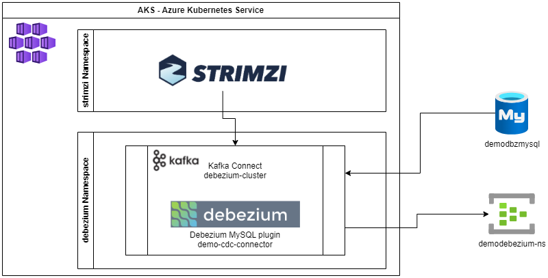

# Tutorial - CDC with Debezium running on AKS and sending events to Azure Event Hub
### This was originally created as a demo to present at TDC Connections 2021, MVPConf2021 and TDC Future 2021 conferences, on sessions which I spoke about Event Driven Architectures and CDC and showed how to deploy Debezium on AKS, configure it to capture changes from a MySQL database and send those events to Azure Event Hub
### It was updated on October/2023, to use newer versions of Debezium, Kafka, Strimzi, and new features of Azure Event Hub (like Compaction on topics). Those changes allowed me to simplify the solution removing the Kafka Broker cluster and the Kafka MirrorMaker2, since now it is possible to deploy the Kafka Connect connected to directly to Azure Event Hub.

#### Architecture of this tutorial 



1. Pre-reqs => For running this demo you will need to:
 	* An Azure Subscription where you have administrative permissions
 	* A Cloud Shell configured to use Bash on that subscription

2. Start by creating the required infrastructure you will need:
	* Use the Bash environment on [Azure Cloud Shell](https://docs.microsoft.com/en-us/azure/cloud-shell/quickstart). 
		- [](https://shell.azure.com/)
	* Select your Subscription, if you have more than one, and create the resource group:
		```bash
		az account set --subscription '<your-subscription-name-or-id>'
		az group create --location eastus --resource-group demodebezium-rg
		```
	* Register some of the required resource providers:
	    ```bash
		az provider register --namespace Microsoft.OperationalInsights
		az provider register --namespace microsoft.insights
		az provider register --namespace Microsoft.ContainerService
		az provider register --namespace Microsoft.ContainerRegistry
		az provider register --namespace Microsoft.Kubernetes
		az provider register --namespace Microsoft.KubernetesConfiguration
		az provider register --namespace Microsoft.EventHub
		```
	* Then create:
	 	- A Log Analytics Workspace;
	 	- An AKS (Azure Kubernetes Service) cluster; 
	 	- An Azure Database for MySQL server;
	 	- An ACR (Azure Container Registry) repository, and;
	 	- An Azure Event Hub namespace
		```bash
		az monitor log-analytics workspace create --resource-group demodebezium-rg --workspace-name demodebezium-laws
		lawsId=`az monitor log-analytics workspace show --resource-group demodebezium-rg --workspace-name demodebezium-laws | jq '.id' -r`
		az aks create --resource-group demodebezium-rg --name demodbzakscluster --node-count 2 --enable-addons monitoring --generate-ssh-keys --workspace-resource-id $lawsId
		az mysql flexible-server create --resource-group demodebezium-rg --name demodbzmysql --location eastus --admin-user debezium --admin-password P@ssw0rd2023 --sku-name Standard_B1s --storage-size 20 --version 8.0.21
		az acr create --resource-group demodebezium-rg --name demodbzacr --sku Basic
		az eventhubs namespace create --name demodebezium-ns --resource-group demodebezium-rg -l eastus
		```
		
		- **_You may need to change the names used here for the MySQL server, the ACR repository and the Event Hub namespace because those names need to be unique. If you do that, you will need to remember to change those names on subsequent commands and, also, inside the provided files. Following is a list of files and the references they have inside:_** 

			| Provided File | References inside |
			|---|---|
			| [debezium-mysql-connector.yaml](./debezium-mysql-connector.yaml) | MySQL server, Azure Event Hub namespace |
			| [kafka-connect.yaml](./kafka-connect.yaml) | ACR repository, Azure Event Hub namespace |

3. Configure some basic things on your MySQL database:
	* Connect to your recently created MySQL (using [MySQL Workbench](https://dev.mysql.com/downloads/workbench/) or any other client tool of your preference), and execute the following commands or use the provided SQL Script file [demo_debezium_grant_privileges.sql](./demo_debezium_grant_privileges.sql):
		```sql
		SET SQL_SAFE_UPDATES=0;
		CALL mysql.az_load_timezone();
		GRANT SELECT, RELOAD, SHOW DATABASES, REPLICATION SLAVE, REPLICATION CLIENT ON *.* TO 'debezium';
		FLUSH PRIVILEGES;
		```
	* On [Azure Portal](https://portal.azure.com/), go to your newly created MySQL server, called `demodbzmysql`, select "Server parameters" on left menu, and:
		- set `binlog_row_image` to `FULL`
		- set `binlog_expire_logs_seconds` to `7200`
		- set `time_zone` to **_<your-time-zone>_**
			- mine is `America/Chicago`, but you can find the available time zones by querying the database:
			```sql
			SELECT name FROM mysql.time_zone_name;
			```
	* You can find more information about MySQL required configurations, [here, on Debezium documentation](https://debezium.io/documentation/reference/connectors/mysql.html#setting-up-mysql).

	* After deploying and configuring the MySQL server, you can use the provided SQL script [demo_debezium_create_database.sql](./demo_debezium_create_database.sql) to create the simple schema used on this demo. Just open this script on MySQL Workbench and run it.

4. Download from GitHub and unzip the 0.38.0 version of [Strimzi](https://strimzi.io/):
	```bash
	curl -L https://github.com/strimzi/strimzi-kafka-operator/releases/download/0.38.0/strimzi-0.38.0.tar.gz --output strimzi-0.38.0.tar.gz
	tar -xvzf strimzi-0.38.0.tar.gz
	rm strimzi-0.38.0.tar.gz
	```

5. Download from Maven and unzip the 2.4.0 version of [Debezium Kafka Connector for MySQL](https://debezium.io/documentation/reference/2.4/connectors/mysql.html):
	```bash
    curl https://repo1.maven.org/maven2/io/debezium/debezium-connector-mysql/2.4.0.Final/debezium-connector-mysql-2.4.0.Final-plugin.tar.gz --output debezium-connector-mysql-2.4.0.Final-plugin.tar.gz
    tar -xvzf debezium-connector-mysql-2.4.0.Final-plugin.tar.gz
    rm debezium-connector-mysql-2.4.0.Final-plugin.tar.gz
	```

6. Connect to AKS and prepare to install Strimzi:
	```bash
	az aks get-credentials --resource-group demodebezium-rg --name demodbzakscluster
	kubectl create ns strimzi
	kubectl create ns debezium
	```

7. Change Strimzi installation files to use your created namespaces
	* Change all files named as `strimzi-0.38.0/install/cluster-operator/\*RoleBinding\*.yaml` replacing `namespace: myProject` with `namespace: strimzi`. You can use the Linux sed utility for that:
	```bash
    cd strimzi-0.38.0
    sed -i 's/namespace: .*/namespace: strimzi/' install/cluster-operator/*RoleBinding*.yaml
	```
	* Then edit `strimzi-0.38.0/install/cluster-operator/060-Deployment-strimzi-cluster-operator.yaml` file to change the `STRIMZI_NAMESPACE` environment variable setting:
		- You can use the Linux nano editor for that:
		```bash
		nano install/cluster-operator/060-Deployment-strimzi-cluster-operator.yaml
		```
		- The resultant section on file should like that:
		```yaml
		# ...
		env:
		- name: STRIMZI_NAMESPACE
		  value: debezium
		# ...
		```

8. Deploy Strimzi to your AKS cluster on "strimzi" namespace and, then, give it permissions to operate on "debezium" namespace where you will deploy the Kafka Connect and Debezium components
	```bash
	kubectl create -f install/cluster-operator/ -n strimzi
    kubectl create -f install/cluster-operator/020-RoleBinding-strimzi-cluster-operator.yaml -n debezium
    kubectl create -f install/cluster-operator/023-RoleBinding-strimzi-cluster-operator.yaml -n debezium
    kubectl create -f install/cluster-operator/031-RoleBinding-strimzi-cluster-operator-entity-operator-delegation.yaml -n debezium
	
	cd ..
	```

9. Prepare to create a Kafka Connect docker image with Debezium and MySQL plugins:
	* Create a `Dockerfile` with the following lines (or use the [provided one](./Dockerfile)):
	```dockerfile
	FROM quay.io/strimzi/kafka:latest-kafka-3.6.0
	USER root:root
	RUN mkdir -p /opt/kafka/plugins/debezium
	COPY ./debezium-connector-mysql/ /opt/kafka/plugins/debezium/
	USER 1001
	```

10. Build the image, push it to Azure Container Registry and attach ACR to your AKS cluster:
	```bash
	az acr build --image debezium/mysql-plugin:v1 --image debezium/mysql-plugin:latest --registry demodbzacr --file Dockerfile .
	az aks update -n demodbzakscluster -g demodebezium-rg --attach-acr demodbzacr
	```

11. Edit the provided [demodebezium-secrets.yaml](./demodebezium-secrets.yaml) to include your Azure Event Hub connection string, which you can find on Azure Portal under the "Shared access policies" menu. If you have changed the MySQL credentials during its creation, update this file with the new credentials too.
	* Replace `<your-azure-eventhub-connection-string>` with your Azure Event Hub connection string
	* Update "mysql-username" and "mysql-password" values, if needed
	* Create a Secret on AKS 
	```bash
	kubectl apply -f demodebezium-secrets.yaml -n debezium
	```
	* Then give the Strimzi operator permissions to access the secret using the two provided files: [connector-configuration-role.yaml](./connector-configuration-role.yaml) and [connector-configuration-role-binding.yaml](./connector-configuration-role-binding.yaml)
	```bash
	kubectl apply -f connector-configuration-role.yaml -n debezium
	kubectl apply -f connector-configuration-role-binding.yaml -n debezium
	```

12. Deploy the Kafka Connect to your AKS cluster using your custom image that includes Debezium and MySQL plugins. Use the provided [kafka-connect.yaml](./kafka-connect.yaml).
	```bash
	kubectl apply -f kafka-connect.yaml -n debezium
	```

13. The Debezium/MySQL connector will need an internal topic that it uses to control the Snapshot strategy and the schema changes. It usually creates this topic automatically but, since we are not using a real Kafka broker but an Azure Event Hub namespace instead, we need to create this topic manually.
	```bash
	az eventhubs eventhub create --resource-group demodebezium-rg --namespace-name demodebezium-ns --name schema-history-internal.demodbz-aks-eh --cleanup-policy Delete --retention-time-in-hours 168 --partition-count 1
	```
	* **_WARNING: When using Kafka, this is a "permanent" topic where messages won't expire and get deleted. Azure Event Hub does not support that type of topic, so messages will expire and deleted. In that case, a new Snapshot will probably occur. Since Debezium uses this topic to decide when a new database snapshot is needed, in your scenario you should evaluate carefully what will be your Snapshot strategy. Refer to [Debezium documentation about this](https://debezium.io/documentation/reference/2.4/connectors/mysql.html#mysql-schema-history-topic)_** 
	
14. Configure the Debezium/MySQL connector to start capturing data changes on MySQL database. Use the provided [debezium-mysql-connector.yaml](./debezium-mysql-connector.yaml). 
	```bash
	kubectl apply -f debezium-mysql-connector.yaml -n debezium
	```

####
#### And voilà... Now all changes happening on your MySQL database are being monitored by Debezium, and all CDC events are being posted on Azure Event Hub... 
####


---
# Some useful commands:

### KafkaConnector deployment status check
```bash
kubectl get kctr demo-cdc-connector -o yaml -n debezium
```

### Get all pods running
```bash
kubectl get pods -n debezium
```

### Get all Strimzi managed components
```bash
kubectl get strimzi -n debezium
```

### Delete the deployed KafkaConnect cluster
```bash
kubectl delete kafkaconnect.kafka.strimzi.io/debezium-cluster -n debezium
```

### Delete the deployed Debezium component
```bash
kubectl delete kafkaconnector.kafka.strimzi.io/demo-cdc-connector -n debezium
```
